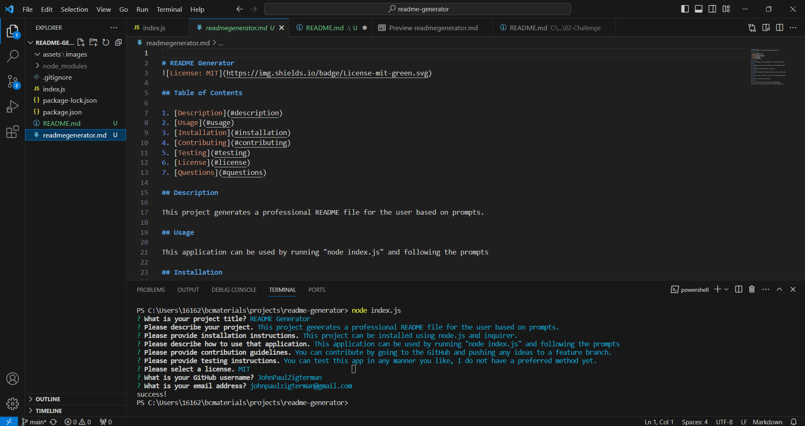

# README Generator - John Zigterman

## Description

- I set out to create an easy to use README generator.
- The generator takes in information from the user about their project, and generates a professional readme.
- The user is prompted for a title, description, installation and usage instructions, testing information, a license, and personal contact information.
- The readme is dynamically generated using their input and is produced in a ready to use manner.
- The user interface is a simple prompt in the console.

## Installation

This is a node.js application and requires the user to use node and to install inquirer for the prompts to function.

## Usage

A user who wishes to generate a professional README will simply initiate the program using "node index.js" and follow the prompts to generate an appropriate README file.

## Credits

I, John Paul Zigterman, completed this project by myself with the aid of the resources provided to me by the MSU coding bootcamp.

## Link

https://johnpaulzigterman.github.io/readme-generator/

## Screenshot

## License

MIT License

Copyright (c) 2023 John Paul Zigterman

Permission is hereby granted, free of charge, to any person obtaining a copy
of this software and associated documentation files (the "Software"), to deal
in the Software without restriction, including without limitation the rights
to use, copy, modify, merge, publish, distribute, sublicense, and/or sell
copies of the Software, and to permit persons to whom the Software is
furnished to do so, subject to the following conditions:

The above copyright notice and this permission notice shall be included in all
copies or substantial portions of the Software.

THE SOFTWARE IS PROVIDED "AS IS", WITHOUT WARRANTY OF ANY KIND, EXPRESS OR
IMPLIED, INCLUDING BUT NOT LIMITED TO THE WARRANTIES OF MERCHANTABILITY,
FITNESS FOR A PARTICULAR PURPOSE AND NONINFRINGEMENT. IN NO EVENT SHALL THE
AUTHORS OR COPYRIGHT HOLDERS BE LIABLE FOR ANY CLAIM, DAMAGES OR OTHER
LIABILITY, WHETHER IN AN ACTION OF CONTRACT, TORT OR OTHERWISE, ARISING FROM,
OUT OF OR IN CONNECTION WITH THE SOFTWARE OR THE USE OR OTHER DEALINGS IN THE
SOFTWARE.